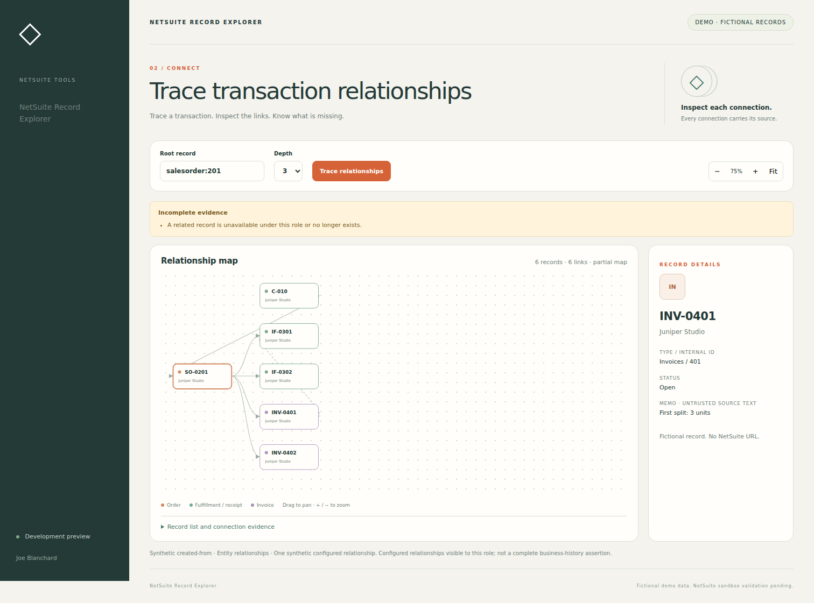

# NetSuite Record Explorer

A read-only NetSuite transaction relationship explorer with bounded graph traversal, source evidence, and explicit coverage limits.

[](https://github.com/Joe-Blanchard-Asheville/netsuite-record-explorer/actions/workflows/ci.yml)

Maintainer: [Joe Blanchard](https://github.com/Joe-Blanchard-Asheville) · JavaScript · SuiteScript 2.1 · Apache-2.0

**Status: development preview.** The fictional-data application runs locally and has automated coverage. The native adapter is implemented but has not been validated in a NetSuite account. Joe will perform the sandbox acceptance checks before a validated integration release.



## Problem

Tracing an order through fulfillment, invoicing, or receiving usually means opening several records. This application puts the configured relationships in one inspectable graph while keeping permission failures and missing coverage visible.

## What it does

- Trace a sales order to its fulfillments and invoices, or a purchase order to receipts.
- Inspect nodes through the graph or the keyboard-accessible record list.
- Pan, zoom, fit the map, and limit traversal depth and node count.
- Retain source evidence for edges and show a partial map when records or relationships are unavailable.

## Run locally

Requires Node.js 22 or newer. No NetSuite credentials are needed for the demo.

```sh
git clone https://github.com/Joe-Blanchard-Asheville/netsuite-record-explorer.git
cd netsuite-record-explorer
npm ci
npm test
npm run build
npm start
```

Open **http://127.0.0.1:4173**. The server binds to loopback and serves fictional fixtures only. Use `PORT=4174 npm start` to run another tool alongside it.

For a server-free review, open `dist/demo.html` after building. It bundles the same application and fixture logic and makes no network requests. The generated sandbox files are in `dist/FileCabinet/SuiteScripts/RecordExplorer/`.

### First walkthrough

Start with salesorder:201. The fictional order has split fulfillments, invoices, and one inaccessible related record. The graph should show a partial-map warning without exposing the denied record.

## Design

| Layer                     | Responsibility                                                                         |
| ------------------------- | -------------------------------------------------------------------------------------- |
| `web/`                    | Single-tool interface, escaped record content, request ordering and clear error states |
| `src/core.js`             | Input validation and shared deterministic search, traversal and evidence primitives    |
| `src/service.js`          | This product's action allowlist and request contracts                                  |
| `src/fixtures.js`         | Fictional records and intentionally denied/incomplete cases                            |
| `src/netsuite-adapter.js` | Native reads through `N/search`, `N/record`, `N/url` and `N/runtime`                   |
| `netsuite/`               | Authenticated Suitelet entry point and disabled-by-default account configuration       |
| `scripts/build.mjs`       | Standalone demo and native deployment files built from the same source                 |

Each repository runs and deploys independently. It vendors the small shared domain/adapter modules rather than requiring another repository or a hosted service. That avoids a package-registry dependency, at the cost of coordinating shared fixes across the sibling projects. There are no runtime npm dependencies or remote UI assets.

The Node demo and NetSuite deployment are separate execution paths. The local server does not connect to NetSuite. The Suitelet runs inside the account and has no record-write endpoint.

## Current limits

Native coverage is sales order → fulfillment/invoice and purchase order → receipt. Payments, custom joins, and entity relationships are excluded. The default graph is 40 nodes and depth 3; maximums are 80 nodes and depth 5. Native usage and latency still need measurement.

Native access follows the Suitelet's execution role. A positive user ID is not sufficient evidence of least privilege. Distributed account access is disabled until the sandbox deployment configuration has been reviewed. Detailed limits and test cases are in [Sandbox setup](docs/SANDBOX.md).

## Verification

```sh
npm test
npm run check
npm run format:check
npm run build
npx playwright install chromium
npm run test:browser
```

Unit and contract tests use fixtures and native API mocks. Browser tests exercise this standalone interface and its offline build. Neither substitutes for a real NetSuite session. CI retains generated packages and browser evidence as downloadable artifacts.

- [Recorded local validation](docs/VALIDATION.json)
- [Sandbox setup and acceptance cases](docs/SANDBOX.md)
- [Acceptance results template](docs/SANDBOX-RESULTS.md)
- [Review findings and remaining work](docs/REVIEW.md)
- [Backlog](docs/BACKLOG.md)
- [Changelog](CHANGELOG.md)

## Development

Keep changes bounded to a documented issue. Run the checks above, add a regression for the changed behavior, and update the changelog. Report fixture, browser and native-account results separately. Never commit account credentials, real customer records, configured sandbox copies or unredacted screenshots. See [Contributing](CONTRIBUTING.md).

## License

[Apache License 2.0](LICENSE). NetSuite is a trademark of Oracle. This is an independent project and is not an Oracle product or certification.
